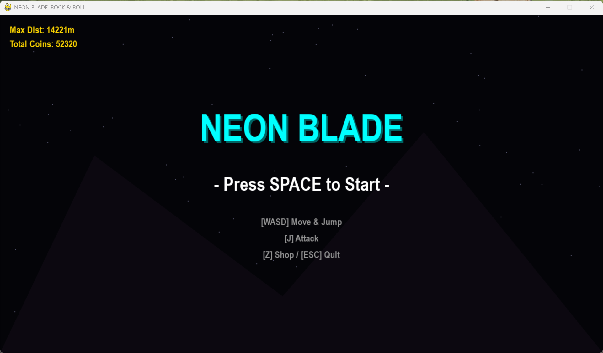
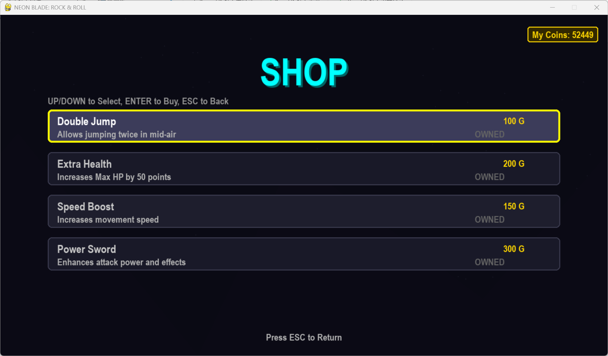
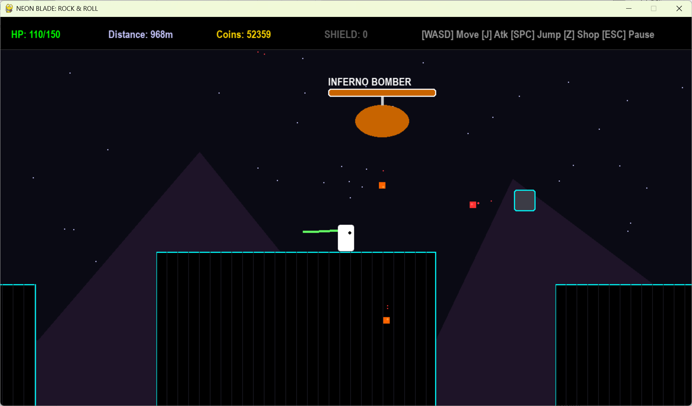

# **Neon Blade: Epic Bosses**

一个快节奏、赛博朋克风格的横版动作冒险游戏。拥有无限生成的地图、丰富的武器系统、史诗级的 Boss 战以及持久化商店系统。

## **🎮 游戏简介**

**Neon Blade** 是一个使用 Python 和 pygame 开发的横版动作游戏。玩家扮演一名手持霓虹光刃的武士，在无尽的赛博世界中奔跑、战斗。你需要躲避致命的陷阱，击败各具特色的敌人，收集金币升级装备，并挑战强大的关卡 Boss。

## **✨ 核心特色**

* **🎨 赛博霓虹美学**：全程序化生成的霓虹视觉效果，包含动态背景、粒子特效、残影系统和屏幕震动反馈。  
* **∞ 无限随机地图**：基于权重系统的无限地图生成器，每次游玩的体验都独一无二。  
* **⚔️ 多样化武器库**：  
  * **光剑 (Sword)**：平衡的标准武器。  
  * **重斧 (Heavy Axe)**：高伤害、大范围，但攻速较慢。  
  * **极速弓 (Rapid Bow)**：远程快速打击。  
  * **激光步枪 (Laser Rifle)**：发射高频穿透激光。  
  * **雷霆战锤 (Thunder Hammer)**：造成大范围闪电爆炸伤害。  
  * **回旋镖 (Boomerang)**：具有无限穿透能力，飞出后自动飞回。  
  * **电吉他 (Rock Guitar)**：释放全屏音波冲击，击退所有敌人。  
* **🤖 丰富的敌人与 Boss**：  
  * **普通敌人**：巡逻兵、无人机、自爆甲虫、炮塔。  
  * **史诗 Boss**：浮空要塞 (Floating Fortress)、暗影行者 (Shadow Walker)、地狱轰炸机 (Inferno Bomber)。  
* **🛒 商店与升级系统**：收集金币，在商店中购买永久升级（二段跳、生命上限、速度提升等）。支持数据自动保存！  
* **🛡️ 道具系统**：拾取护盾、血包和各种武器掉落物来增强生存能力。

## **📸 游戏截图**

*(在此处替换为你游戏的实际截图)*

| 主菜单 | 战斗画面 |
| :---- | :---- |
| [ | [![image-20251230165511887]](pic/image-20251230165511887.png) |

| 商店界面 | Boss 战 |
| :---- | :---- |
| [| [ ]|

## **🚀 快速开始**

### **前置要求**

确保你的电脑上安装了 Python 3.12。

### **安装步骤**

1. **克隆仓库**：  
   
   ```bash
   git clone https://github.com/xuemanya/AIgame.git
   cd AIgame
   ```
   
2. 安装依赖：
   此游戏仅依赖 pygame 库。  
   
   ```bash
   pip install pygame
   ```
   
3. **运行游戏**：  
   
   ```bash
   python main.py
   ```

## **⌨️ 操作指南**

| 按键 | 动作 |
| :---- | :---- |
| **W / A / S / D** | 移动 / 跳跃 / 下蹲 |
| **SPACE (空格)** | 跳跃 (支持二段跳) |
| **J** | 攻击 (根据武器不同有不同效果) |
| **Z** | 打开商店 / 购买物品 |
| **ESC** | 暂停游戏 / 返回上一级菜单 |
| **R** | 快速重置游戏 (游戏中) |

## **📂 项目结构**

为了保持代码整洁，项目采用了模块化设计：

* main.py: **游戏入口**。包含主循环、状态机（菜单/游戏/商店/暂停）、事件处理和 UI 绘制。  
* config.py: **配置中心**。统一管理全局常量、颜色定义、物理参数和游戏平衡数值。  
* entities.py: **实体逻辑**。定义了 Player (玩家)、Enemy (敌人基类) 以及基本的陷阱和道具。  
* weapons.py: **武器系统**。包含所有投射物（箭矢、激光、回旋镖、音波）和地面掉落武器的逻辑。  
* advanced\_enemies.py: **高级怪物**。包含自爆甲虫、炮塔、蝙蝠等复杂敌人的 AI 逻辑。  
* bosses.py: **Boss 系统**。定义了三个 Boss 的行为模式、技能循环和血条显示。  
* world.py: **地图生成**。负责无限地图的生成算法、权重随机刷怪以及 Boss 竞技场的构建。  
* store.py: **数据持久化**。处理金币/分数的保存与读取 (json)，以及商店物品的管理。  
* vfx.py: **视觉特效**。包含粒子系统、屏幕震动相机、残影效果和浮动文字。

## **🛠️ 后续计划**

* \[ \] 添加背景音乐和音效 (BGM & SFX)  
* \[ \] 设计更多种类的 Boss  
* \[ \] 增加成就系统  
* \[ \] 支持手柄操作

## **🤝 贡献**

欢迎提交 Issue 或 Pull Request 来改进这个游戏！如果你有很酷的想法（比如新武器或新怪物），请告诉我！
